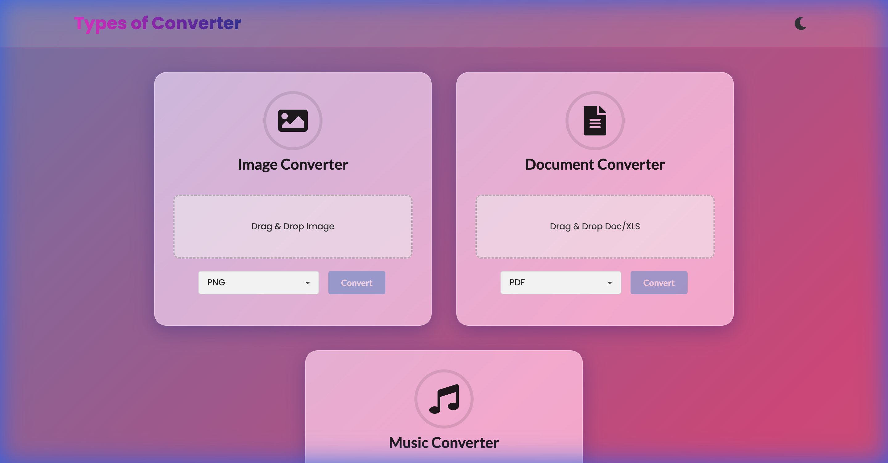
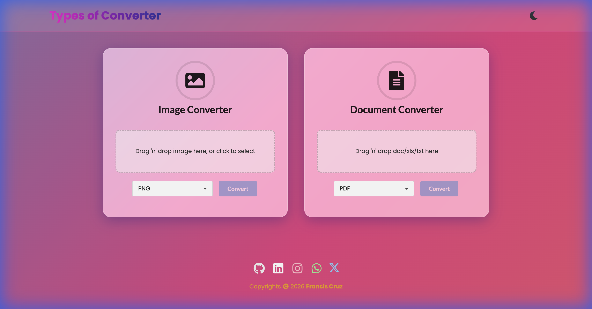

# Types of Converter

A premium, all-in-one file conversion Progressive Web App (PWA) built with React and Vite. Convert images, documents, and audio files entirely client-side with a beautiful glassmorphism UI.

## 🌐 Live Demo

🔗 **Live Site:** 
[https://songplayerapp.netlify.app/](https://songplayerapp.netlify.app/)



## ✨ Features

### 1. 🖼️ Image Converter
Convert between common image formats instantly.
- **Supported Inputs**: PNG, JPG, BMP, WEBP, GIF
- **Supported Outputs**: PNG, JPG, WEBP, BMP, GIF
- **Features**: Drag & Drop support, Client-side processing (Privacy focused).

### 2. 📄 Document Converter
Handle document and spreadsheet conversions with ease.
- **Spreadsheets**: Convert Excel (`XLSX`, `XLS`) to `CSV`, `JSON`, `HTML`, or `TXT`.
- **Documents**: Convert Word (`DOCX`) and Text (`TXT`) to `PDF`.
- **Smart Detection**: Automatically detects input type and shows relevant conversion options.

### 3. 🎵 Music Converter
**New Feature!** Powerful audio conversion running directly in your browser using WebAssembly.
- **Supported Formats**: MP3, WAV, OGG, AAC.
- **Technology**: Powered by `ffmpeg.wasm`.
- **Performance**: Multi-threaded encoding (requires COEP headers).

### 4. 🎨 Premium Design
- **Glassmorphism**: Beautiful frosted glass cards and UI elements.
- **Animations**: Smooth entrance animations (Framer Motion) and hover effects.
- **Themes**: Fully functional **Dark/Light mode** toggle with vibrant animated gradients.
  - *Dark Mode*: Deep Navy to Emerald Green Gradient.
  - *Light Mode*: Sunset Orange to Teal Gradient.



### 5. 📱 PWA Support
- Installable as a native-like app on Desktop and Mobile.
- Offline capability enabled via `vite-plugin-pwa`.

## 🚀 Getting Started

### Prerequisites
- Node.js (v18+)

### Installation

1.  Clone the repository:
    ```bash
    git clone https://github.com/ajf013/converter-app.git
    cd converter-app
    ```

2.  Install dependencies:
    ```bash
    npm install
    ```

3.  Start the development server:
    ```bash
    npm run dev
    ```

4.  Open `http://localhost:5173` (or the port shown in terminal).

### ⚠️ Note on Audio Conversion
To enable the **Music Converter**, the server must serve files with specific security headers (`Cross-Origin-Embedder-Policy` and `Cross-Origin-Opener-Policy`). This is already configured in `vite.config.js` for development.

## 🛠️ Built With
- **React 18** - UI Library
- **Vite** - Build Tool
- **Semantic UI React** - Component Framework
- **Framer Motion** - Animations
- **FFmpeg.wasm** - Audio Processing
- **SheetJS (xlsx)** - Spreadsheet Processing
- **jsPDF & Mammoth** - Document Processing

## 👨‍💻 Author
**Francis Cruz**
- [GitHub](https://github.com/ajf013)
- [LinkedIn](https://www.linkedin.com/in/ajf013-francis-cruz/)

## You can reach out 😊😊
Feel free to contact me about the problems. I will try to help as much as I can 😉

[](https://www.linkedin.com/in/ajf013-francis-cruz/)
[](mailto:cruzmma2021@gmail.com)
[](https://github.com/ajf013)