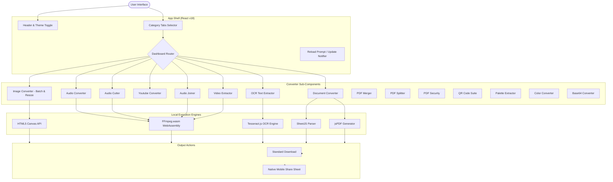

# Types of Converter 🛠️

A premium, all-in-one file conversion Progressive Web App (PWA) built with React, Vite, and Capacitor. Convert images, documents, and audio files entirely client-side with a beautiful glassmorphism UI, tabbed layouts, file previews, and native sharing.

### 🌐 [Live Site](https://converter.fcruz.org/)

---

## 🛠️ Tech Stack & Versions

| Technology | Badge / Icon | Version | Description |
| :--- | :--- | :--- | :--- |
| **React** |  | `v18.2.0` | Frontend UI Component rendering |
| **Vite** |  | `v7.2.4` | High-speed frontend build engine |
| **Capacitor** |  | `v8.3.1` | Native Android & iOS wrapper layer |
| **FFmpeg.wasm** |  | `v0.12.15` | Client-side audio processing |
| **Tesseract.js** |  | `v7.0.0` | Client-side Image-to-Text OCR |
| **SheetJS** |  | `v0.18.5` | Spreadsheet parser and generator |
| **pdf-lib** |  | `v1.17.1` | Client-side PDF reader/editor and merger |
| **jsPDF** |  | `v3.0.4` | Document-to-PDF generator |
| **Framer Motion** |  | `v12.23.26` | Animated components and transitions |
| **Semantic UI** |  | `v2.1.5` | Form layout and utility UI controls |
| **JSZip** |  | `v3.10.1` | ZIP compression and archiving library |
| **QRCode / jsQR** |  | `v1.5.4 / v1.4.0` | Client-side QR generator and scanner |

---

## 🚀 What's New in Version 1.5.0 ✨

* 🗜️ **Standalone Image Compressor:** Extracted image compression from Image Converter into a dedicated tool card featuring quality presets, exact percentage sliders, original vs compressed size comparison metrics, and batch ZIP export.
* 🌐 **Favicon & App Icon Generator:** Upload any logo or image to generate multi-resolution favicons (`16x16` to `512x512`), `site.webmanifest`, and copyable HTML `<link>` code tags with ZIP download.
* 🛡️ **File Checksum & String Hash Suite:** Calculate SHA-256, SHA-512, SHA-1, and MD5 hashes instantly with 1-click copy buttons and built-in expected checksum matching.
* 👁️‍🗨️ **EXIF Metadata & Privacy Cleaner:** Inspect photo metadata and strip camera models, timestamps, and GPS geolocation tags client-side before sharing.
* 📊 **JSON / CSV / SQL Data Suite:** Convert, format, and validate between CSV tables, pretty/minified JSON arrays, and SQL `INSERT INTO` statements.
* 🎨 **Dropdown UI & Stacking Elevation:** Elevated active card stacking context (`z-index: 1000`) and solid opaque dropdown menus to ensure dropdown options display crisp and unobscured.

---

## 🚀 What's New in Version 1.4.0 ✨

* 🛡️ **Universal Watermark Remover:** Strip text watermarks, backgrounds, and layout image stamps from PDF, Word (`.docx`), and Excel (`.xlsx`) files completely locally inside the browser sandbox.
* 🪄 **AI Auto-Detection:** Leverage Azure OpenAI (GPT-4o) integration to automatically detect watermark text, colors, and layout configurations, avoiding manual user positioning.
* 🎨 **Redesigned Glassmorphic UI:** A visual overhaul featuring beautiful glassmorphic frosted cards, wandering background gradient blobs, and refined CSS layout variables.
* 🌓 **Cosmic Dark & Alabaster Light Themes:** Toggle between a glowing dark theme or a soft paper-like light theme, both calibrated with perfect text readability and contrast.

---

## 🚀 What's New in Version 1.3.0 ✨

* 🔄 **Convert PDF Navigation Tab:** Dedicated navigation tab housing all converters.
* 📄 **Office to PDF Converters:** Local client-side conversion of Word (`.docx`), Excel (`.xlsx`), and PowerPoint (`.pptx`) documents into PDFs.
* 📝 **PDF to Office Converters:** Extract layout text back to Word (`.doc`), Excel (`.xlsx`), and PowerPoint presentation outline structures completely offline.
* ✍️ **Sign PDF:** Draw signature on an overlay canvas and stamp it on first, last, or custom page ranges with adjustable scale.
* 🗜️ **Compress PDF:** Re-sample and optimize page images to reduce PDF files sizes client-side.
* 🖼️ **PDF to JPG:** Export all pages as independent JPG images packaged inside a `.zip` archive.
* 💾 **PDF/A Standardizer:** Append PDF/A conforming metadata archives to standard PDF structures.

---

## 🚀 What's New in Version 1.2.0 ✨

* 🗂️ **PDF Utilities Tab & Suite:** Added local tools to merge multiple PDF files, split PDF pages, or extract specific page ranges (packaged as a ZIP archive), and password-encrypt or decrypt PDFs locally.
* ⚡ **Batch Image Converter & Resizer:** Drop multiple images at once, customize percentage or custom pixel dimensions (with aspect-ratio locking), compression quality slider, and batch download all as a ZIP file.
* 🎨 **Design & Color Utilities Tab:** Extract dominant 6-color swatches from images using canvas clustering, and convert color codes instantly in real-time (HEX, RGB, HSL, CMYK).
* 🔗 **QR Code Suite:** Generate styled QR codes (Wi-Fi, contact vCard, URL/Text) with custom colors, and scan codes via webcam feed or image upload.
* 🔏 **Base64 Encoder/Decoder:** Convert files of any type into Base64 URI strings, or decode strings back to downloadable file binary format.
* 🕒 **Conversion History & App Update System:** Access local transaction logs, dynamic chime sound effects, and launch version-check modal notifications with force hard refresh controls.

---

## 🚀 What's New in Version 1.1.0 ✨

* 🗂️ **Categorized Navigation Tabs:** Redesigned layout to filter and group tools into specific tabs (*All Tools*, *Image Tools*, *Audio & Video*, *Documents & OCR*, *YouTube Downloader*).
* 🖼️ **Image Previews:** Users can now see a thumbnail preview of their selected images inside the dropzone prior to starting conversions.
* 📱 **Native Share Integration:** Uses the Web Share API to activate iOS and Android share sheets natively, letting users share files immediately to WhatsApp, Slack, etc.
* 🎨 **Global Design System Fixes:** Added root variables inside `index.css` to fix dark/light mode rendering variables.
* ⚙️ **Code Modularization:** Converted the massive monolithic layout into decoupled sub-components inside the `components/Converter/components` folder for clean engineering.

---

## 🏗️ Architecture & Component Flow

### System Architecture
The app runs completely client-side in the browser or mobile WebView sandbox. No user files are sent to backend servers, providing total data privacy.


```mermaid
graph TD
    User([User Interface])
    subgraph UI ["App Shell (React v18)"]
        Header[Header & Theme Toggle]
        Tabs[Category Tabs Selector]
        Dashboard{Dashboard Router}
        Reload[Reload Prompt / Update Notifier]
    end

    subgraph Converters ["Converter Sub-Components"]
        ImgC[Image Converter - Batch & Resize]
        DocC[Document Converter]
        AudC[Audio Converter]
        YtC[Youtube Converter]
        OcrC[OCR Text Extractor]
        CutC[Audio Cutter]
        JoinC[Audio Joiner]
        VidC[Video Extractor]
        PdfM[PDF Merger]
        PdfS[PDF Splitter]
        PdfSec[PDF Security]
        QrSuite[QR Code Suite]
        PalExt[Palette Extractor]
        ColConv[Color Converter]
        B64Conv[Base64 Converter]
    end

    subgraph Engines ["Local Execution Engines"]
        Canvas[HTML5 Canvas API]
        Ffmpeg[FFmpeg.wasm WebAssembly]
        Tesseract[Tesseract.js OCR Engine]
        SheetJS[SheetJS Parser]
        JsPDF[jsPDF Generator]
    end

    subgraph Actions ["Output Actions"]
        Download[Standard Download]
        Share[Native Mobile Share Sheet]
    end

    User --> Header
    User --> Tabs
    Tabs --> Dashboard
    Dashboard --> ImgC & DocC & AudC & OcrC & CutC & JoinC & VidC & YtC

    ImgC --> Canvas
    AudC --> Ffmpeg
    CutC --> Ffmpeg
    JoinC --> Ffmpeg
    VidC --> Ffmpeg
    OcrC --> Tesseract
    DocC --> SheetJS & JsPDF

    Canvas & Ffmpeg & Tesseract & SheetJS & JsPDF --> Actions
    Actions --> Download
    Actions --> Share
```

### Conversion Lifecycle Flowchart


```mermaid
flowchart TD
    Start([User Drops File]) --> Validate{Is File Valid?}
    Validate -- No --> Error[Show Error Message]
    Validate -- Yes --> FilePreview[Render Visual File Preview]
    
    FilePreview --> SelectFormat[Select Output Format]
    SelectFormat --> ClickConvert[Click Convert]
    
    ClickConvert --> Processing[Process File Client-Side]
    Processing --> ConversionSuccess{Conversion Success?}
    
    ConversionSuccess -- No --> ConversionError[Show Conversion Error Alert]
    ConversionSuccess -- Yes --> ShowResult[Display Download & Share Buttons]
    
    ShowResult --> ClickAction{User Choice}
    ClickAction -- Download --> BrowserDownload[Browser initiates standard download]
    ClickAction -- Share --> CheckShareAPI{Device Supports Sharing?}
    
    CheckShareAPI -- Yes --> NativeShare[Open native Android/iOS share sheet]
    CheckShareAPI -- No --> BrowserDownload
```

---

## 📂 Directory Tree Structure

```text
converter-app/
├── android/                   # Android Capacitor Project
├── public/                    # PWA Icons and Static Assets
├── src/
│   ├── assets/                # Local Assets
│   ├── components/            # React UI Components
│   │   ├── Converter/         # Main Converter Dashboard
│   │   │   ├── components/    # Modular Converter Toolcards
│   │   │   │   ├── AudioConverter.jsx
│   │   │   │   ├── AudioCutter.jsx
│   │   │   │   ├── AudioJoiner.jsx
│   │   │   │   ├── Base64Converter.jsx
│   │   │   │   ├── ColorConverter.jsx
│   │   │   │   ├── DocConverter.jsx
│   │   │   │   ├── HistoryLog.jsx
│   │   │   │   ├── ImageConverter.jsx
│   │   │   │   ├── OcrConverter.jsx
│   │   │   │   ├── PaletteExtractor.jsx
│   │   │   │   ├── PdfMerger.jsx
│   │   │   │   ├── PdfSecurity.jsx
│   │   │   │   ├── PdfSplitter.jsx
│   │   │   │   ├── QrSuite.jsx
│   │   │   │   ├── UpdateNotification.jsx
│   │   │   │   ├── VideoExtractor.jsx
│   │   │   │   └── YoutubeConverter.jsx
│   │   │   ├── Converter.css  # Tab and Card Styling
│   │   │   └── Converter.jsx  # Main Dashboard Controller
│   │   ├── Footer/            # Footer Social component
│   │   ├── Header/            # Sticky Header & Theme toggle
│   │   └── ReloadPrompt/      # PWA Live Update Notifier
│   ├── contexts/              # Light/Dark Theme Contexts
│   ├── utils/
│   │   ├── conversionUtils.js # SheetJS, jsPDF, FFmpeg modules
│   │   ├── historyUtils.js    # Local logs and dynamic Audio Context chimes
│   │   └── shareUtils.js      # Web Share API wrapper
│   ├── App.css                # Global backgrounds and scrollbars
│   ├── App.jsx                # Main Application Shell
│   ├── index.css              # Design system styling tokens
│   └── main.jsx               # Entry-point initialization
├── capacitor.config.json      # Native Mobile Wrapper Settings
├── eslint.config.js           # Lint Rules Config
├── package.json               # Manifest (v1.3.0) & Scripts
├── README.md                  # Project Documentation
└── vite.config.js             # DevServer headers and PWA plugin
```

---

## 🔄 Mobile Updates & Auto-Update Mechanism

### 1. PWA Browser Updates
When static assets change on production, the service worker detects the updated hash. `ReloadPrompt` notifies users with a custom alert listing the **v1.2.0 updates**, inviting them to tap **Update Now** to load the new code instantly, or **Hard Refresh** to force-clear the cache on any system.

### 2. Capacitor (Android/iOS) Native Updates
To ensure native mobile users receive updates seamlessly without manually updating through the Play Store/App Store, we recommend integrating:
* **Capgo OTA (Over-the-Air) updates:** Configured inside `capacitor.config.json` to fetch the latest production JavaScript bundle from Netlify/Vercel on app startup and refresh the webview immediately in the background.
* **Ionic Appflow Live Updates:** Serves the new JS/HTML payload automatically to native wrappers on boot.

---

## 🚀 Getting Started

### Prerequisites
- Node.js (v18+)

### Installation & Run

1.  Clone the repository:
    ```bash
    git clone https://github.com/ajf013/converter-app.git
    cd converter-app
    ```
2.  Install dependencies:
    ```bash
    npm install
    ```
3.  Start development server:
    ```bash
    npm run dev
    ```
4.  Open `http://localhost:5173`.

---

## Author

### 👤 Francis Ponnu Cruz I
> **Azure Cloud & DevOps Engineer | Microsoft Certified Trainer (MCT)**

#### 🌐 Connect with Me:
[](https://github.com/ajf013)
[](https://www.linkedin.com/in/ajf013-francis-cruz/)
[](https://x.com/Itsme_Ajf013)
[](https://fcruz.org)
[](https://linktr.ee/AJF013)

